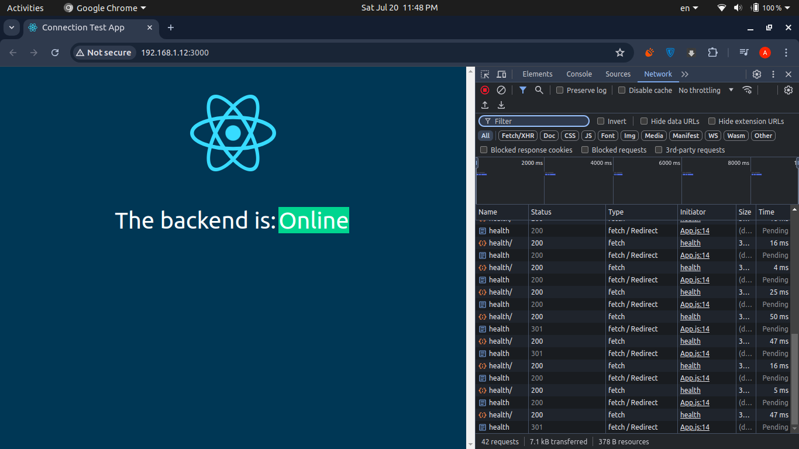
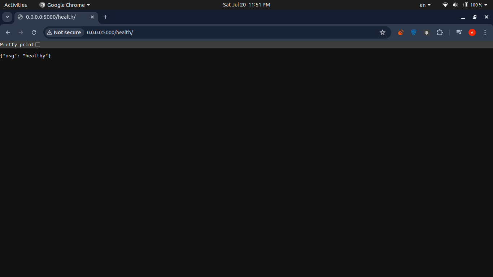

<h3 align="center">Connection Test Application Project</h3>

<div align="center">
  
  <p align="center">Front End Page</p>
</div>
<div align="center">
  
  <p align="center">Back End Page</p>
</div>


## Overview

The Connection Test Application is designed to demonstrate the integration between a Django backend API and a React frontend application. The React app displays "online" when it successfully accesses the Django API, ensuring the functionality and health of the connection between the two services. This project embodies key DevOps principles, utilizing Jenkins, Docker, Kubernetes, and ArgoCD to ensure smooth deployment, scalability, and automation.

## Prerequisites

1. **Run Ngrok**:
   Establish a tunnel between localhost and the public network using Ngrok:
   ```sh
   ngrok http http://localhost:8080
   ```
   Copy the public URL and add it to your GitHub webhook settings:
   - Go to GitHub repository `Online-Test-App-CI` >> Settings >> Webhooks >> Add webhook >> Paste the public URL in the "Payload URL" field.

2. **Configure Jenkins Parameters**:
   - GitHub username
   - GitHub token
   - Credential ID: `github`
   - DockerHub username
   - DockerHub password
   - Credential ID: `docker-cred`

3. **Configure CI Job**:
   - Enable `GitHub hook trigger for GITScm polling`.

4. **Configure CD Job**:
   - Enable `This project is parameterized`.
   - Add a string parameter: `GIT_COMMIT_REV`.

## Run Project Locally

1. **Start Backend**:
   ```sh
   cd backend/
   python3 manage.py runserver 0.0.0.0:5000
   cd ..
   ```

2. **Start Frontend**:
   ```sh
   cd frontend/
   npm run build
   serve -s build
   ```

3. Open [http://localhost:3000](http://localhost:3000) in your browser to see the application running online.

## Run with Docker

1. **Build and Run Backend**:
   ```sh
   cd backend/
   docker build -t ahmedatiia11/django_app .
   docker run -p 5000:5000 ahmedatiia11/django_app
   cd ..
   ```

2. **Build and Run Frontend**:
   ```sh
   cd frontend/
   docker build -t ahmedatiia11/react-nginx-img .
   docker run -p 3000:3000 ahmedatiia11/react-nginx-img
   ```

3. Open [http://localhost:3000](http://localhost:3000) in your browser to see the application running online.

### Fully Automated Project

1. **Push changes to GitHub**:
   Push changes to the GitHub repository `Online-Test-App-CI`.

2. **Trigger CI Job**:
   The GitHub webhook triggers the "Online-Test-App-CI" job, executing the Jenkinsfile.

3. **CI Jenkinsfile Stages**:
   - Clone the GitHub repository.
   - Build Docker images with the following names:
     ```sh
     dockerhub-accountname/django_app:<commit-number>
     dockerhub-accountname/react-nginx-img:<commit-number>
     ```
   - Push the Docker images to DockerHub Registry.
   - Trigger the "Connection-Test-App-CD" job, passing the commit number as a parameter.

